# [📈 Live Status](https://uptime.skwal.net): <!--live status--> **🟧 Partial outage**

This repository contains the open-source uptime monitor and status page for [Léopold Koprivnik](https://skwal.net/), powered by [Upptime](https://github.com/upptime/upptime).

With [Upptime](https://upptime.js.org), you can get your own unlimited and free uptime monitor and status page, powered entirely by a GitHub repository. We use [Issues](https://github.com/SkwalExe/uptime.skwal.net/issues) as incident reports, [Actions](https://github.com/SkwalExe/uptime.skwal.net/actions) as uptime monitors, and [Pages](https://uptime.skwal.net) for the status page.

<!--start: status pages-->
<!-- This summary is generated by Upptime (https://github.com/upptime/upptime) -->
<!-- Do not edit this manually, your changes will be overwritten -->
<!-- prettier-ignore -->
| URL | Status | History | Response Time | Uptime |
| --- | ------ | ------- | ------------- | ------ |
|  [Skwal](https://skwal.net) | 🟩 Up | [skwal.yml](https://github.com/SkwalExe/uptime.skwal.net/commits/HEAD/history/skwal.yml) | 

 563ms
     
 | 

<a href="https://uptime.skwal.net/history/skwal">100.00%</a>
    

|  [Skwal (IPv6)](https://skwal.net) | 🟩 Up | [skwal-i-pv6.yml](https://github.com/SkwalExe/uptime.skwal.net/commits/HEAD/history/skwal-i-pv6.yml) | 

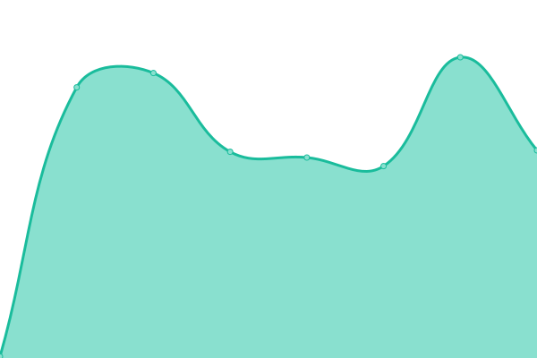 156ms
     
 | 

<a href="https://uptime.skwal.net/history/skwal-i-pv6">100.00%</a>
    

|  [Skwal Forum](https://forum.skwal.net) | 🟩 Up | [skwal-forum.yml](https://github.com/SkwalExe/uptime.skwal.net/commits/HEAD/history/skwal-forum.yml) | 

 555ms
     
 | 

<a href="https://uptime.skwal.net/history/skwal-forum">100.00%</a>
    

|  [Skwal Forum (IPv6)](https://forum.skwal.net) | 🟩 Up | [skwal-forum-i-pv6.yml](https://github.com/SkwalExe/uptime.skwal.net/commits/HEAD/history/skwal-forum-i-pv6.yml) | 

 160ms
     
 | 

<a href="https://uptime.skwal.net/history/skwal-forum-i-pv6">100.00%</a>
    

|  [Skwal Blog](https://blog.skwal.net) | 🟩 Up | [skwal-blog.yml](https://github.com/SkwalExe/uptime.skwal.net/commits/HEAD/history/skwal-blog.yml) | 

 690ms
     
 | 

<a href="https://uptime.skwal.net/history/skwal-blog">100.00%</a>
    

|  [Skwal Blog (IPv6)](https://blog.skwal.net) | 🟩 Up | [skwal-blog-i-pv6.yml](https://github.com/SkwalExe/uptime.skwal.net/commits/HEAD/history/skwal-blog-i-pv6.yml) | 

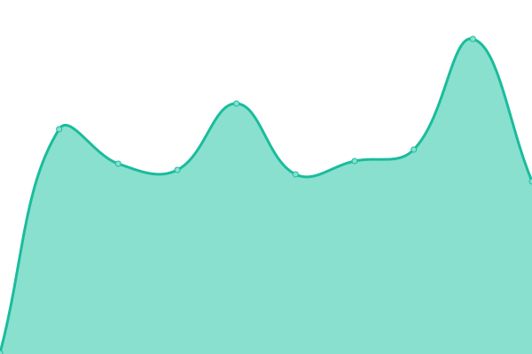 369ms
     
 | 

<a href="https://uptime.skwal.net/history/skwal-blog-i-pv6">100.00%</a>
    

|  [Mail Server](https://mail.skwal.net) | 🟩 Up | [mail-server.yml](https://github.com/SkwalExe/uptime.skwal.net/commits/HEAD/history/mail-server.yml) | 

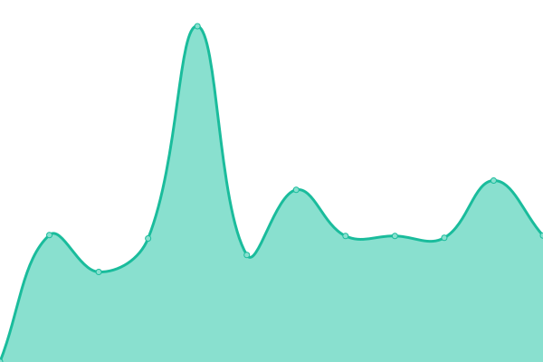 596ms
     
 | 

<a href="https://uptime.skwal.net/history/mail-server">100.00%</a>
    

|  [Mail Server (IPv6)](https://mail.skwal.net) | 🟩 Up | [mail-server-i-pv6.yml](https://github.com/SkwalExe/uptime.skwal.net/commits/HEAD/history/mail-server-i-pv6.yml) | 

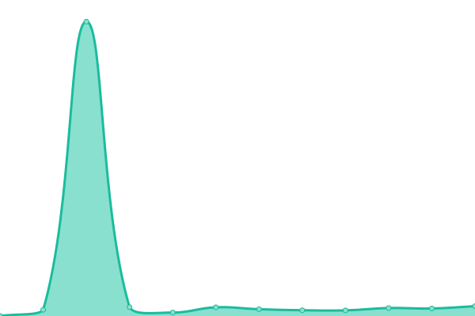 251ms
     
 | 

<a href="https://uptime.skwal.net/history/mail-server-i-pv6">100.00%</a>
    

|  [Mozart Panel](https://mozart.skwal.net) | 🟩 Up | [mozart-panel.yml](https://github.com/SkwalExe/uptime.skwal.net/commits/HEAD/history/mozart-panel.yml) | 

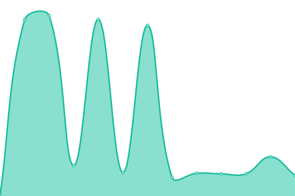 474ms
     
 | 

<a href="https://uptime.skwal.net/history/mozart-panel">100.00%</a>
    

|  [Mozart Panel (IPv6)](https://mozart.skwal.net) | 🟩 Up | [mozart-panel-i-pv6.yml](https://github.com/SkwalExe/uptime.skwal.net/commits/HEAD/history/mozart-panel-i-pv6.yml) | 

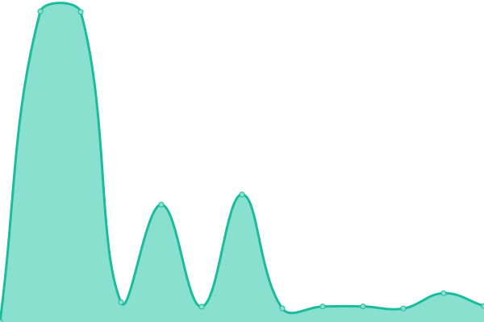 147ms
     
 | 

<a href="https://uptime.skwal.net/history/mozart-panel-i-pv6">100.00%</a>
    

|  [Shlink Server](https://link.skwal.net) | 🟩 Up | [shlink-server.yml](https://github.com/SkwalExe/uptime.skwal.net/commits/HEAD/history/shlink-server.yml) | 

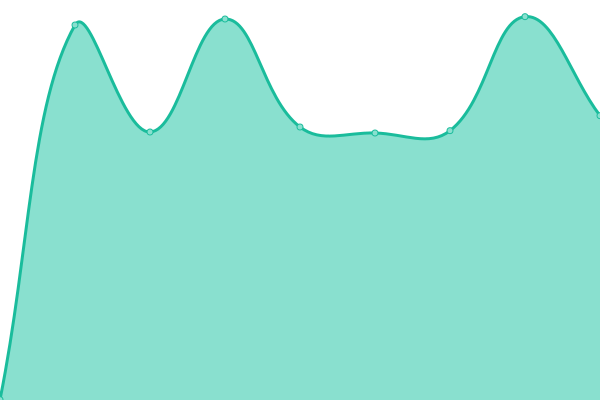 976ms
     
 | 

<a href="https://uptime.skwal.net/history/shlink-server">100.00%</a>
    

|  [Shlink Server (IPv6)](https://link.skwal.net) | 🟩 Up | [shlink-server-i-pv6.yml](https://github.com/SkwalExe/uptime.skwal.net/commits/HEAD/history/shlink-server-i-pv6.yml) | 

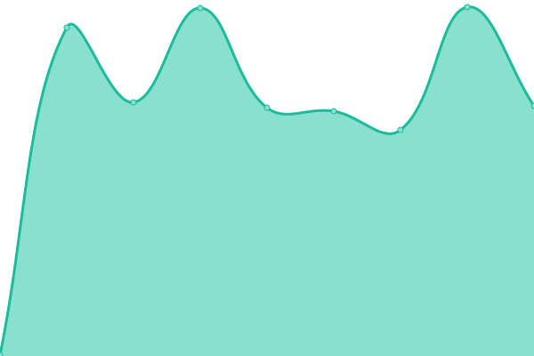 304ms
     
 | 

<a href="https://uptime.skwal.net/history/shlink-server-i-pv6">100.00%</a>
    

|  [Share Server](https://share.skwal.net) | 🟩 Up | [share-server.yml](https://github.com/SkwalExe/uptime.skwal.net/commits/HEAD/history/share-server.yml) | 

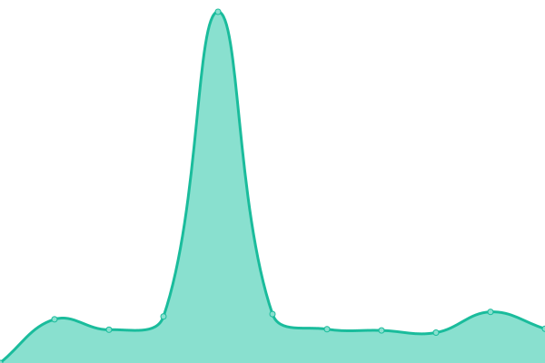 806ms
     
 | 

<a href="https://uptime.skwal.net/history/share-server">100.00%</a>
    

|  [Share Server (IPv6)](https://share.skwal.net) | 🟩 Up | [share-server-i-pv6.yml](https://github.com/SkwalExe/uptime.skwal.net/commits/HEAD/history/share-server-i-pv6.yml) | 

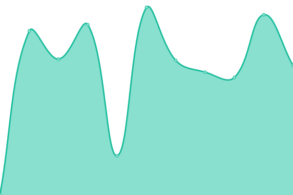 513ms
     
 | 

<a href="https://uptime.skwal.net/history/share-server-i-pv6">100.00%</a>
    

|  [Portfolio](https://portfolio.skwal.net) | 🟩 Up | [portfolio.yml](https://github.com/SkwalExe/uptime.skwal.net/commits/HEAD/history/portfolio.yml) | 

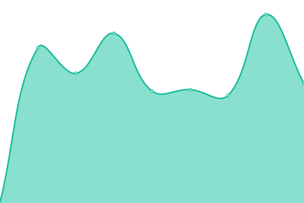 440ms
     
 | 

<a href="https://uptime.skwal.net/history/portfolio">100.00%</a>
    

|  [Portfolio (IPv6)](https://portfolio.skwal.net) | 🟩 Up | [portfolio-i-pv6.yml](https://github.com/SkwalExe/uptime.skwal.net/commits/HEAD/history/portfolio-i-pv6.yml) | 

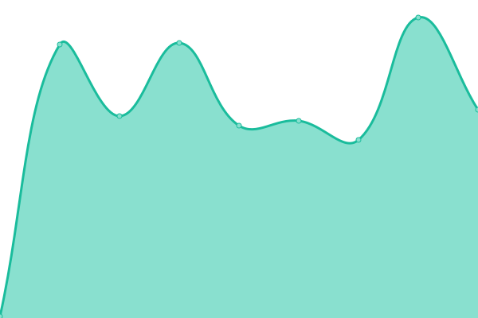 128ms
     
 | 

<a href="https://uptime.skwal.net/history/portfolio-i-pv6">100.00%</a>
    

|  [Ente](https://ente.skwal.net) | 🟥 Down | [ente.yml](https://github.com/SkwalExe/uptime.skwal.net/commits/HEAD/history/ente.yml) | 

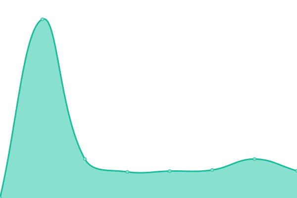 580ms
     
 | 

<a href="https://uptime.skwal.net/history/ente">0.00%</a>
    

|  [Ente (IPv6)](https://ente.skwal.net) | 🟥 Down | [ente-i-pv6.yml](https://github.com/SkwalExe/uptime.skwal.net/commits/HEAD/history/ente-i-pv6.yml) | 

 283ms
     
 | 

<a href="https://uptime.skwal.net/history/ente-i-pv6">0.00%</a>
    

|  [Google](https://www.google.com) | 🟩 Up | [google.yml](https://github.com/SkwalExe/uptime.skwal.net/commits/HEAD/history/google.yml) | 

 121ms
     
 | 

<a href="https://uptime.skwal.net/history/google">100.00%</a>
    

<!--end: status pages-->

[**Visit our status website →**](https://uptime.skwal.net)

## 📄 License

- Powered by: [Upptime](https://github.com/upptime/upptime)
- Code: [MIT](./LICENSE) © [Anand Chowdhary](https://anandchowdhary.com), supported by [Pabio](https://pabio.com)
- Data in the `./history` directory: [Open Database License](https://opendatacommons.org/licenses/odbl/1-0/)
